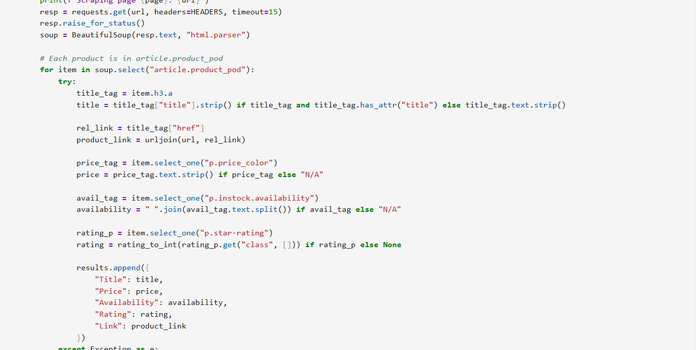

# 📌 Web Scraping Book Prices

## 📌 Overview
This project performs web scraping to collect required details from online sources (provided URL input) and stores them in a structured CSV file.
It is implemented using Python in a Jupyter Notebook (Web_scraping_prices.ipynb).

## 📂 Project Structure

## ✨ Features
✔ Scrapes required details from provided container names that contains the data  
✔ Saves results as CSV  
✔ Clean, reusable scraping method  
✔ Notebook demonstrates logic and verification  

## 🛠️ Technologies Used
▫️ Python  
▫️ Jupyter Notebook  
▫️ Pandas  
▫️ Requests/BeautifulSoup  

## 📌 How to Use
### 1️⃣ Clone repository
🔹 git clone https://github.com/BirajDas27/Web-Scraper-Python.git

### 2️⃣ Install dependencies
🔹 pip install pandas  
🔹 pip install requests  
🔹 pip install beautifulsoup4  
🔹 pip install jupyter  

### 3️⃣ Run notebook
🔹 jupyter notebook Web_scraping_prices.ipynb

## 📊 Output
🔸 Data is stored in books_all.csv.  
🔸 Preview example:  
    import pandas as pd  
    pd.read_csv("books_all.csv").head()

## 📸 Screenshots & Results
### Code to extract key details

### Result CSV

## 🚀 Future Improvements
🔹 Add scraper for multiple websites  
🔹 Automate periodic scraping  
🔹 Visualize price trends  

## 🤝 Contribution
Fork & improve! PRs welcome 😊

## 📜 License
Open-source — feel free to reuse.
